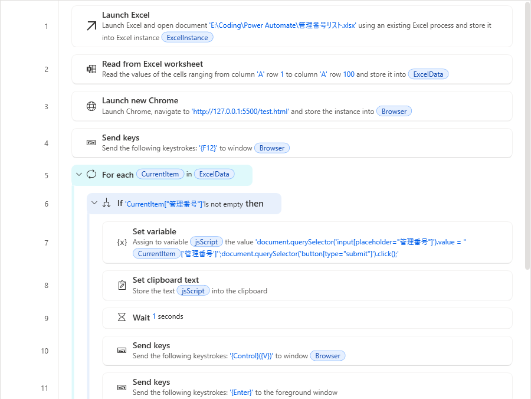
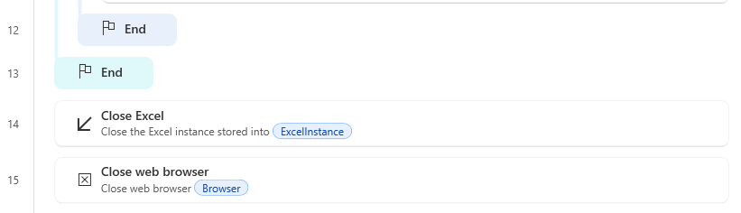

# Power Automate Desktop（PAD）＋ JavaScript实现网页自动化指南

---

## 📖 前言

本指南针对**仅允许安装 PAD + Chrome** 的特殊环境下的自动化需求进行编写。  
（如果环境允许，通常会更推荐使用 Selenium IDE 或 Tampermonkey 这类脚本工具。）

---

## 🎯 设定场景

假设我们有一个如下的 Excel 文件：

| A列 | 管理番号 |
|---|---|
| A2 | 154615656 |
| A3 | 586156156 |
| A4 | 45454564 |
| A5 | 564564564 |

希望能够**自动将这些数据依次输入到网页表单中并提交**。

---

## 🧠 遇到的难点

- PAD 在识别 WebApp 的 UI 元素时（特别是动态网页），**CSS选择器识别容易失败**
- 动态 DOM 结构变化导致**PAD无法稳定识别元素**

---

## 🛠 解决方案概览

使用 Chrome 的 **F12 Console**，**直接输入并执行 JavaScript 脚本**来操作网页元素。

- 特别适合用于**软刷新型页面**（即不进行传统重定向，而是通过 JavaScript 更新 DOM 的网页）。

---

## 🔄 自动化流程图

```
start
: 打开 Excel;
: 打开 Chrome;
: 按 F12 打开 Console;
loop (遍历每一行数据)
    : 设置 jsScript 脚本内容;
    : 复制到剪贴板;
    : 等待1秒;
    : 发送 Ctrl+V 粘贴;
    : 发送 Enter 执行;
end loop
: 关闭 Excel;
: 关闭 Chrome;
stop
```

---

## 🖼 示例流程截图

你可以参考以下流程截图：



---

## ⚡ 注意事项

- 第一次打开 F12 Console 时，可能会弹出 "Welcome" 之类的提示框，**请事先手动关闭**。  
  （否则自动化时焦点无法正确切换到输入区）

- 建议在正式运行前，手动测试一下：  
  - 打开 Console 后，**不点击鼠标，直接按 Ctrl+V 粘贴**或**直接打字**，确认能正常输入。

---

## 🧩 如何书写 JavaScript（基础篇）

1. 打开网页，按 F12 打开 Console
2. 点击输入框元素，查看 HTML 代码（例）：

```html
<input type="text" id="fname" name="fname" placeholder="管理番号">
```

3. 根据元素特征，编写对应的 JavaScript：

```javascript
document.querySelector('input[placeholder="管理番号"]').value = '%CurrentItem["管理番号"]%';
```

> 💡 提示：CSS 选择器有多种写法，实际使用中可以根据实际网页自由选择更稳定的方式。

---

## 🧩 如何书写 JavaScript（进阶篇）

如果网页上有多个输入框（例如管理番号、公司名、地址等），可以依次填写：

```javascript
document.querySelector('input[placeholder="会社名"]').value = 'Test Company';
document.querySelector('input[placeholder="住所"]').value = 'Your address';
document.querySelector('input[placeholder="管理番号"]').value = '%CurrentItem["管理番号"]%';
document.querySelector('button[type="submit"]').click();
```

当然，也可以将公司名、地址等字段从 Excel 动态读取，而不是写死！

---

# ✨ 总结

掌握这个方法后，  
即使未来 Web 系统升级改版，只要网页结构可见，**你依然可以稳定实现自动输入**！

不用担心一开始觉得难，  
**慢慢一步步跟着练习，很快就能上手了！**😊

---

